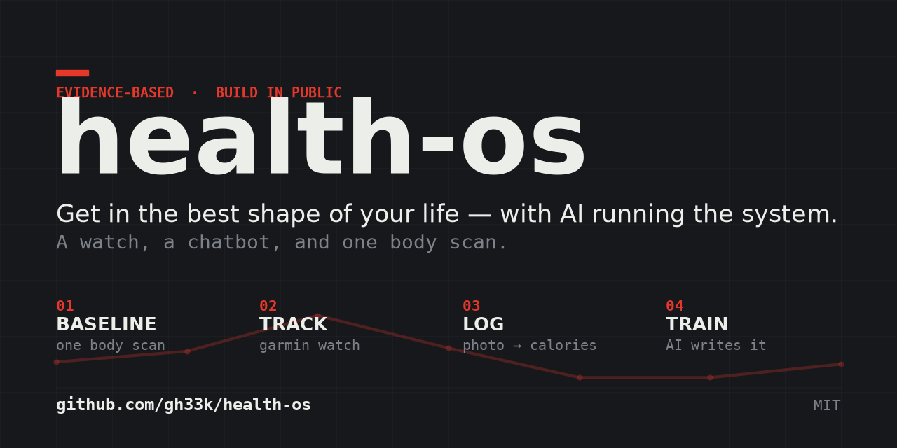

# health-os



An AI-run system for getting in shape — the setup I built to lose 5 kg of fat
without losing muscle before my wedding, with the thinking handed off to an AI so
I just show up and lift.

No coach. No app subscription. A watch, a chatbot, and one body scan.

> **Honest expectations:** this is a builder's starter kit, not a one-tap app.
> Budget ~20–30 minutes and bring your own API key and a Garmin watch. What you
> get in return is a system you fully own — your data, your files, no monthly fee,
> and an AI that can reshape the whole plan from a single sentence.

## The idea

Four moving parts, each doing the one thing it's best at:

| Part | Job | Tool |
|------|-----|------|
| **Baseline** | Know your real starting point (fat vs muscle, not just weight) | One InBody / DEXA scan |
| **Tracking** | Capture weight, steps, sleep, workouts with zero manual entry | Garmin watch + scale |
| **Food log** | Log a meal in 5 seconds | `meal-bot` (Telegram + Claude vision) |
| **Training** | Workouts written by AI, guided on your wrist | `gwk` (this repo → Garmin Connect) |

The loop: the scan sets the target → the watch and scale track reality → the bot
logs food and a weekly recalculation adjusts your calories → the AI writes and
tweaks the workouts. You lift; the system thinks.

## What's in here

- **`gwk/`** — a CLI that turns plain-text workout files into structured Garmin
  workouts (running *and* strength, with real rep counting and rest timers) and
  pushes them to your watch. See below.
- **`workouts/`** — example workout files (an outdoor-gym strength split, an easy
  run, a 5K) to copy and edit.
- **`meal-bot/`** — the photo-to-calories Telegram bot. See
  [`meal-bot/README.md`](meal-bot/README.md).

## Quick start — workouts on your watch

Requires [uv](https://docs.astral.sh/uv/) (a fast Python manager).

```sh
git clone <your-fork-url> health-os && cd health-os
uv sync
uv run gwk login          # one-time Garmin Connect auth (see note below)
uv run gwk validate workouts/*.yaml
uv run gwk push workouts/*.yaml
```

Sync your watch and the workouts appear under **Training → Workouts**, guided
step by step — named exercises, rep counts, automatic rest timers.

A workout is just a text file:

```yaml
name: Full Body A
sport: strength          # strength | running | cycling | cardio
steps:
  - warmup: 5:00
  - exercise: BENCH_PRESS/SMITH_MACHINE_BENCH_PRESS
    sets: 3
    reps: 10
    rest: 2:00
  - run: 25:00
    hr_zone: 2
```

`uv run gwk exercises <term>` searches Garmin's ~1400-exercise library for the
right key. Full command list: `uv run gwk --help`.

### Note on Garmin login

Garmin's login endpoint rate-limits data-center IP addresses hard. If you run
this on a home machine you'll be fine. On a VPS, log in from your laptop first,
then copy the `~/.garminconnect` token file over — the token works from anywhere
for about a year; only the initial login is picky.

## Bring your own keys

Nothing in this repo contains credentials. You supply:

- A **Garmin** account (and a watch + optionally an Index scale)
- A **Telegram bot token** (free, from @BotFather) for the meal bot
- **Claude Code CLI** access for the vision estimates
- One **body-composition scan** to set your baseline — the single most useful
  measurement you'll take

Copy `.env.example` to `meal-bot/.env` and fill in your own values. `.env` and
all personal data are git-ignored.

## A note on the training advice

The example workouts follow evidence-based hypertrophy principles (train near
failure, 10–20 sets per muscle per week, full range of motion, progressive
overload, protein 1.6–2.2 g/kg on a cut). None of this is medical advice —
it's what worked for one healthy adult. Talk to a doctor before a big diet or
training change, especially if you have any health conditions.

## License

MIT — do whatever you want with it. If it helps you, that's the whole point.
